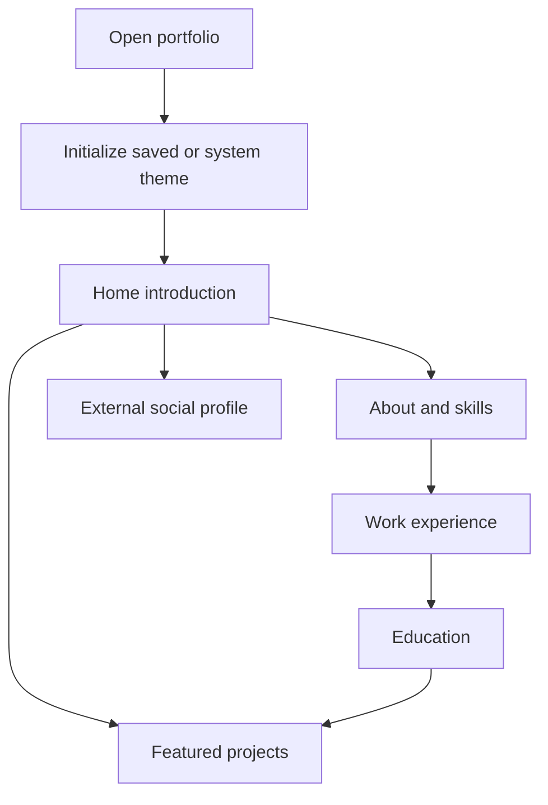
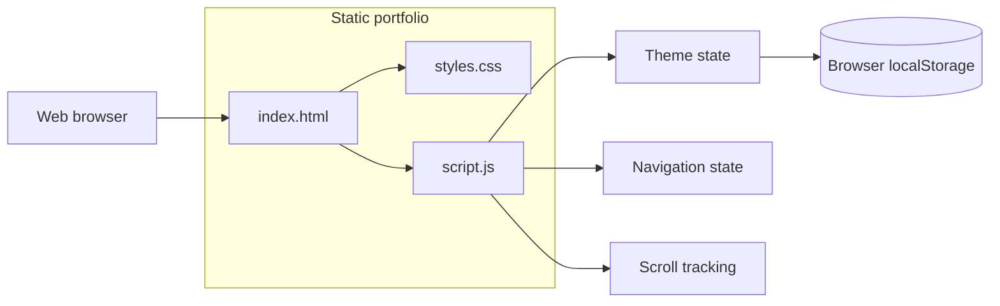

<div align="center">

# Flavio — Personal Portfolio

### Responsive full-stack developer portfolio built with HTML, CSS, and vanilla JavaScript

A modern, accessible, single-page portfolio presenting Flavio's profile, technical skills, education, professional experience, and selected software projects.

[](#project-status)
[](#technology-stack)
[](#technology-stack)
[](#technology-stack)
[](#accessibility)
[](#getting-started)

</div>

---

## Overview

This repository contains a personal portfolio website for **Flavio**, presented as a full-stack developer and Information and Communication Technology student.

The project is a static single-page website built without a frontend framework or build system. It uses:

- semantic HTML for structure and content;
- custom CSS for layout, responsive behavior, theming, and visual design;
- vanilla JavaScript for theme persistence, mobile navigation, smooth scrolling, and active-section tracking.

The portfolio currently includes:

- a professional introduction;
- an About section;
- a technical-skills grid;
- internship experience;
- ICT education;
- featured projects;
- social links;
- responsive light and dark themes.

Because the site has no runtime dependencies, it can be opened directly in a browser or hosted on any static hosting platform.

---

## Purpose

The portfolio is designed for:

- internship and junior developer applications;
- school and academic presentations;
- professional networking;
- showcasing technical progress;
- presenting selected projects in one place;
- demonstrating frontend fundamentals without relying on a framework.

It also demonstrates practical knowledge of:

1. semantic HTML;
2. responsive layouts;
3. CSS custom properties;
4. dark and light theme design;
5. browser local storage;
6. scroll-based navigation state;
7. Intersection Observer;
8. mobile-menu state management;
9. accessible labels;
10. progressive enhancement with JavaScript.

---

## Portfolio content

### Professional profile

The website presents Flavio as a:

```text
Full Stack Developer & Student
```

The profile focuses on modern web development, responsive interfaces, frontend and backend implementation, and solving practical problems through clean code.

### Technologies shown

```text
HTML
CSS
JavaScript
React
React Native
TypeScript
Node.js
Express
Expo
C++
C#
SQL Server
MongoDB
Supabase
Git
GitHub
```

### Experience

```text
Role:     Intern Full Stack Developer
Company:  Albanian Business Partner
Period:   November 2025 – April 2026
```

The experience description highlights:

- responsive and accessible interfaces;
- HTML, CSS, and JavaScript;
- React component architecture;
- React Native cross-platform development;
- Node.js and Express backend services;
- REST API integration;
- TypeScript for maintainability and type safety.

### Education

```text
School:   Hermann Gmeiner Vocational High School
Program:  Information and Communication Technology
Period:   2023 – 2027
```

The education section highlights software development, web technologies, networking, database management, full-stack projects, and programming fundamentals.

### Featured projects

#### TiranaHub

Presented with:

```text
HTML
CSS
JavaScript
Node.js
MongoDB
```

#### ShikoIPTV

Presented with:

```text
C#
WPF
```

#### MyHealthApp

Presented as an in-progress project with:

```text
React Native
Expo
Node.js
MongoDB
```

---

## Core features

### Single-page navigation

The site contains these main sections:

```text
Home
About
Experience
Education
Projects
```

### Responsive navigation

- desktop navigation bar;
- mobile menu button;
- mobile navigation panel;
- active-section highlighting;
- smooth scrolling;
- automatic mobile-menu reset after resizing to desktop width.

### Dark and light themes

- system-theme detection on first visit;
- manual theme toggle;
- selected theme stored in `localStorage`;
- CSS variables for both themes;
- mobile theme label;
- matching theme icons.

### Active-section tracking

The implementation combines:

- scroll-position calculations;
- `IntersectionObserver`;
- section data attributes;
- desktop and mobile navigation updates.

### Accessibility-oriented markup

- semantic page sections;
- logical headings;
- descriptive title and meta description;
- `aria-label` values for icon controls and social links;
- native buttons and links;
- improved accent contrast.

### Zero runtime dependencies

The portfolio does not require:

- Node.js;
- npm;
- React;
- a bundler;
- a package manager;
- a database;
- an API server.

---

## User flow



---

## Architecture



The browser loads:

```text
index.html
    ├── styles.css
    └── script.js
```

There is no server-rendering step, framework hydration, backend, or database.

---

## Technology stack

| Area | Technology |
|---|---|
| Structure | HTML5 |
| Styling | CSS3 |
| Interactivity | Vanilla JavaScript |
| Theme persistence | Web Storage API |
| Section tracking | Intersection Observer API |
| Layout | CSS Grid and Flexbox |
| Color system | CSS custom properties and OKLCH |
| Icons | Inline SVG |
| Deployment | Any static host |
| Build system | None |
| Runtime dependencies | None |

---

## Repository structure

```text
about-me/
├── index.html       # Portfolio content and page structure
├── styles.css       # Theme, layout, cards, typography, and responsive styles
├── script.js        # Theme, menu, scrolling, and active-section logic
└── README.md        # Project documentation
```

---

## Theme system

The theme is initialized by checking:

1. the saved `theme` value;
2. the browser's `prefers-color-scheme` setting;
3. the dark class included in the initial HTML.

Conceptually:

```js
const savedTheme = localStorage.getItem("theme");
const systemTheme = window.matchMedia("(prefers-color-scheme: dark)").matches
  ? "dark"
  : "light";

currentTheme = savedTheme || systemTheme;
```

When the visitor changes theme, the selected value is stored under:

```text
theme
```

The value remains local to the browser and is not sent to a server.

---

## Navigation and scrolling

The JavaScript provides:

- smooth scrolling with a fixed-header offset;
- active navigation state for desktop and mobile;
- a compact scrolled navigation state;
- an Intersection Observer with a visibility threshold;
- mobile menu opening and closing;
- automatic menu reset above the mobile breakpoint.

The current mobile breakpoint used by JavaScript is:

```text
768px
```

The JavaScript and CSS breakpoints should remain aligned.

---

## Responsive design

The layout is designed for:

- desktop monitors;
- laptops;
- tablets;
- mobile phones.

Recommended viewport tests:

```text
320 × 568
375 × 667
390 × 844
768 × 1024
1024 × 768
1366 × 768
1440 × 900
1920 × 1080
```

Verify that there is no horizontal scrolling, clipped text, overlapping navigation, or unusable project card layout.

---

## Accessibility

### Existing foundations

- page language declared as English;
- UTF-8 encoding;
- responsive viewport metadata;
- semantic `header`, `nav`, `main`, `section`, and `footer` elements;
- hierarchical headings;
- native interactive elements;
- `aria-label` values on icon controls;
- visible text labels;
- improved contrast;
- keyboard-operable controls.

### Recommended improvements

- add a skip-to-content link;
- add stronger `:focus-visible` styles;
- add `aria-expanded` to the mobile menu button;
- add `aria-controls` linking the button and menu;
- support closing the menu with `Escape`;
- test reduced-motion behavior;
- hide decorative SVGs from assistive technology;
- make project cards actionable with descriptive links;
- test at 200% and 400% zoom;
- test with NVDA, VoiceOver, and TalkBack.

---

## SEO and metadata

The page currently includes:

- UTF-8 metadata;
- responsive viewport configuration;
- the title `Flavio - Full Stack Developer`;
- a professional meta description.

Recommended additions:

- canonical URL;
- Open Graph metadata;
- social-preview image;
- favicon;
- Twitter/X card metadata;
- JSON-LD `Person` data;
- sitemap;
- robots.txt;
- real project and social profile URLs.

---

## Getting started

### Clone the repository

```bash
git clone https://github.com/Flavio-07/about-me.git
cd about-me
```

No dependency installation is required.

---

## Run locally

### Open directly

Open `index.html` in a modern browser.

### Python static server

```bash
python -m http.server 5500
```

Windows alternative:

```powershell
py -m http.server 5500
```

Then open:

```text
http://localhost:5500
```

### Visual Studio Code Live Server

1. Open the repository in Visual Studio Code.
2. Install Live Server.
3. Right-click `index.html`.
4. Select **Open with Live Server**.

### Node static server

```bash
npx serve .
```

---

## Deploy with GitHub Pages

1. Open the repository on GitHub.
2. Open **Settings**.
3. Select **Pages**.
4. Choose **Deploy from a branch**.
5. Select branch `main`.
6. Select folder `/ (root)`.
7. Save.

The deployment URL normally follows this pattern:

```text
https://<github-username>.github.io/about-me/
```

Before deployment, update all placeholder links, hard-coded dates, project descriptions, and social metadata.

---

## Customization

### Update identity and role

Edit in `index.html`:

```html
<span class="hero-name">Flavio</span>
<p class="hero-role">Full Stack Developer & Student</p>
```

### Update biography

Edit the paragraphs inside:

```html
<section id="about">
```

Avoid hard-coding age unless it will be maintained regularly.

### Update skills

Edit items inside:

```html
<div class="tech-grid">
```

### Add experience

Duplicate an `experience-card` and update the role, organization, date range, and responsibilities.

### Add education

Duplicate an `education-card` and update the institution, program, dates, and description.

### Add projects

Duplicate a `project-card` and update:

```html
<h3 class="project-title">Project Name</h3>
<p class="project-description">Project description</p>
```

Add technology badges with:

```html
<span class="project-tag">Technology</span>
```

### Update social links

The current website uses generic destinations such as:

```text
https://github.com
https://linkedin.com
https://twitter.com
https://instagram.com
```

Replace them with the actual profile URLs before professional publication.

GitHub should point to:

```text
https://github.com/Flavio-07
```

---

## Content maintenance

Values that require periodic review include:

```text
Age: 18
Internship: November 2025 – April 2026
Education: 2023 – 2027
Footer: © 2025
```

The age and footer year are especially likely to become outdated.

Recommended maintenance:

- verify links monthly;
- update project status after major changes;
- add repository and live-demo links;
- update role and education dates;
- remove outdated technology claims;
- review spelling and grammar;
- test mobile layout;
- check browser console errors.

---

## Browser compatibility

The site relies on modern browser features:

- CSS custom properties;
- OKLCH colors;
- `color-mix()`;
- `localStorage`;
- `matchMedia`;
- `IntersectionObserver`;
- smooth scrolling.

Recommended browsers:

- current Chrome;
- current Edge;
- current Firefox;
- current Safari.

Older browsers may render some colors or effects differently.

---

## Performance

### Current strengths

- no framework bundle;
- no external package dependencies;
- no API calls;
- no database;
- inline SVG icons;
- small JavaScript surface;
- static-hosting compatibility.

### Potential improvements

- minify CSS and JavaScript;
- optimize future project screenshots;
- use modern image formats;
- define image dimensions;
- add Content Security Policy;
- test with Lighthouse on the deployed URL;
- enable appropriate static caching.

---

## Security and privacy

The current site has a limited security and privacy surface:

- no account system;
- no contact form;
- no backend;
- no analytics;
- no advertising;
- no personal-data database;
- only theme preference is stored locally.

External links use:

```html
rel="noopener noreferrer"
```

Before publishing:

- verify every external URL;
- avoid exposing private phone numbers or addresses;
- avoid committing confidential files;
- review any future analytics integration;
- consider a Content Security Policy.

---

## Manual verification

### Initial load

- `index.html` opens without errors;
- CSS and JavaScript load;
- hero content appears;
- browser console remains clean.

### Theme

- system theme is detected;
- theme toggle works;
- preference survives refresh;
- mobile theme label updates;
- contrast remains readable.

### Navigation

- every section control scrolls correctly;
- active section changes while scrolling;
- fixed-header offset is correct;
- mobile menu opens and closes;
- selecting a mobile link closes the menu;
- resizing to desktop resets mobile state.

### Content

- skills grid wraps correctly;
- experience and education cards remain readable;
- project cards align correctly;
- footer remains inside viewport;
- social links point to intended profiles.

### Accessibility

- keyboard-only navigation works;
- focus remains visible;
- heading order is logical;
- controls have accessible names;
- 200% zoom remains usable;
- no information relies only on color.

---

## Known limitations

| Area | Current limitation |
|---|---|
| Content management | All content is hard-coded in HTML |
| Social links | Generic placeholder destinations |
| Project links | No repository or live-demo actions |
| Project media | Color blocks instead of screenshots |
| Contact | No contact form or email action |
| Age | Biography contains a hard-coded age |
| Footer | Copyright year is hard-coded to 2025 |
| Localization | English only |
| Testing | No automated tests |
| CI/CD | No GitHub Actions workflow |
| Accessibility | No skip link or complete screen-reader audit |
| Reduced motion | No dedicated reduced-motion behavior |
| SEO | No Open Graph, canonical URL, or structured data |
| Deployment | No deployment workflow committed |
| License | No explicit license file |

---

## Recommended roadmap

### Phase 1 — Professional content

- replace generic social URLs;
- remove or automatically maintain age;
- update footer year;
- improve project descriptions;
- add repository links;
- add live demos;
- add screenshots;
- add CV download;
- add email contact action.

### Phase 2 — Accessibility

- add skip-to-content link;
- add `aria-expanded` and `aria-controls`;
- support Escape-key menu closing;
- strengthen focus states;
- add reduced-motion support;
- audit headings and SVGs;
- test screen readers.

### Phase 3 — SEO

- add canonical URL;
- add Open Graph tags;
- add social-preview image;
- add favicon;
- add structured data;
- add sitemap and robots.txt.

### Phase 4 — Project case studies

- explain project goals;
- document architecture decisions;
- show technical challenges and solutions;
- add screenshots and demos;
- add measurable outcomes;
- clarify personal contribution.

### Phase 5 — Automation

- add HTML validation;
- add Stylelint and ESLint;
- add Prettier;
- add Playwright smoke tests;
- add accessibility checks;
- add Lighthouse CI;
- add broken-link checks;
- add GitHub Actions.

---

## Development guidelines

### HTML

- preserve semantic structure;
- keep headings logical;
- use buttons for actions and links for destinations;
- add alternative text for real images;
- avoid duplicate IDs;
- keep personal information current.

### CSS

- reuse design tokens;
- preserve light and dark theme parity;
- avoid fixed dimensions that break mobile layouts;
- include focus-visible states;
- test contrast;
- keep breakpoints aligned with JavaScript.

### JavaScript

- keep theme and menu state synchronized;
- expose accessibility state when controls change;
- avoid blocking scroll handlers;
- null-check queried elements;
- add tests as interaction complexity grows.

### Commit examples

```text
feat: add project repository links
fix: close mobile menu with Escape
accessibility: add skip navigation link
seo: add Open Graph metadata
content: update internship experience
style: improve project-card mobile layout
test: add navigation smoke tests
docs: document GitHub Pages deployment
```

---

## Project status

**Status: active static portfolio**

The current implementation provides:

- responsive single-page layout;
- professional hero section;
- About, Experience, Education, and Projects sections;
- technical-skills grid;
- dark and light modes;
- saved theme preference;
- mobile navigation;
- smooth scrolling;
- active navigation state;
- accessibility-oriented improvements;
- zero-dependency deployment.

The highest-priority improvements are replacing placeholder links, adding real project actions and screenshots, removing time-sensitive age text, updating the footer year, and completing accessibility and SEO audits.

---

## License

This repository is public, but it does not currently include an explicit `LICENSE` file.

Public visibility does not automatically grant permission to copy, modify, distribute, or reuse the source code or personal portfolio content.

All rights remain reserved unless the repository owner adds a license defining permitted use.

---

<div align="center">

Built with semantic HTML, responsive CSS, and vanilla JavaScript.

**Flavio — Full Stack Developer & ICT Student**

</div>
